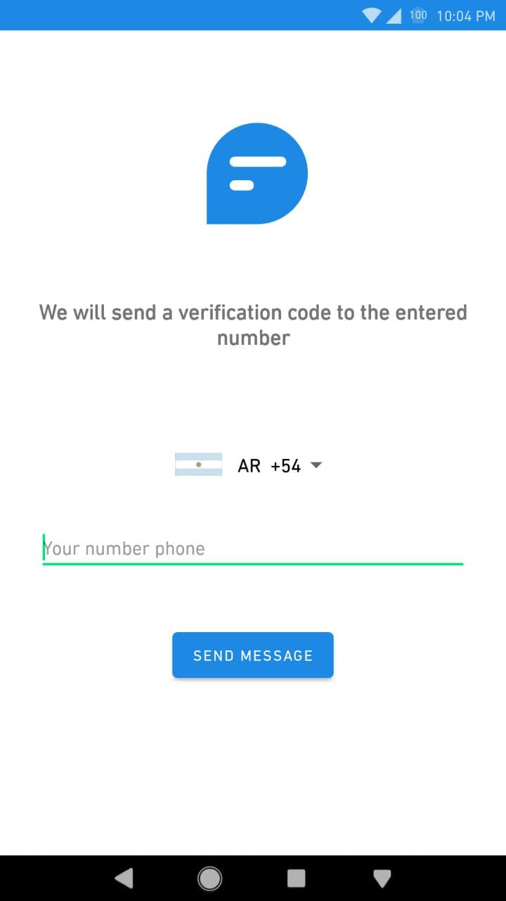
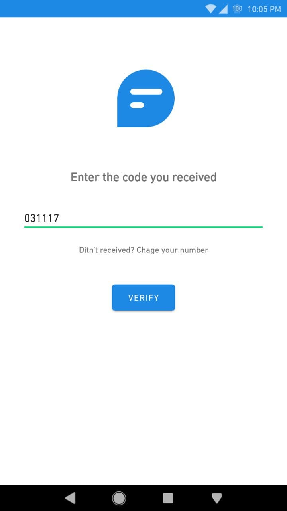
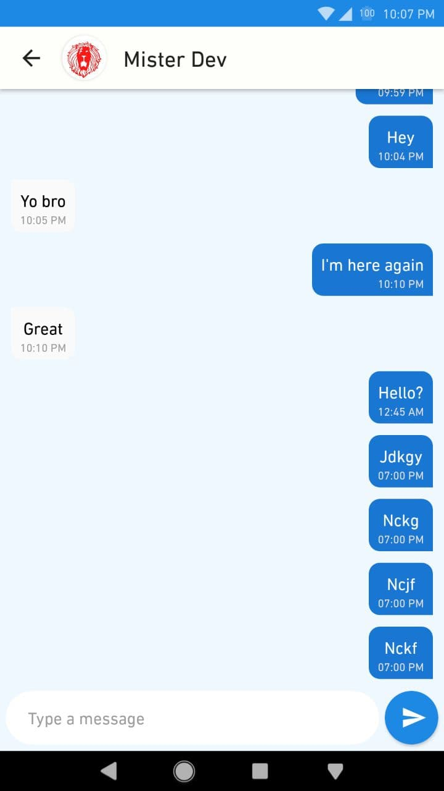
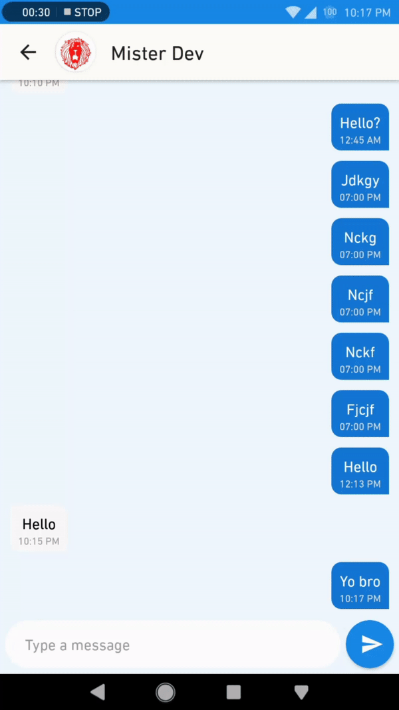

# ChatApp
Instant messaging app with basic functionalities:
* Send and receive text messages.
* Set profile image and username
* See whether a contact is online or not.
* Messages are saved on the device so you dont need internet connection to view them.
* Login through your phone number.

### Display

  

### Profile

### Chat

## Library

* [Realtime Database](https://firebase.google.com/docs/database)
* [Firebase Authentification](https://firebase.google.com/docs/auth)
* [Cloud Storage](https://firebase.google.com/docs/storage)
* [Room Persistence Library](https://developer.android.com/topic/libraries/architecture/room)
* [Country Code Picker](https://github.com/hbb20/CountryCodePickerProject)

## Developed By

Olariaga Martin
